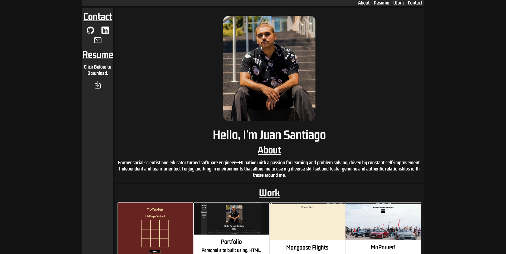

# Juan Santiago Portfolio

The following app is my portfolio! This website was built using, HTML, CSS, and Javascript. In it you will find information about me, my resume that you can view/download, links to my projects, and links to my Github, Linkedin, and Email.

## Getting Started:
The following is the link to the [portfolio](https://juan-santiago-portfolio-99.netlify.app/) and the link to the [Trello](https://trello.com/b/ETNSKCuh/juan-santiago-portfolio).

## Technologies Used:

- Ionicons 5.5.2
- Google Fonts

## Next Steps: 

- AAU, I should be able to collapse and expand my resume.
- AAU, I should be able to horizontally scroll through my works.
- AAU, I should be able to have a mobile friendly way to view a pdf.
