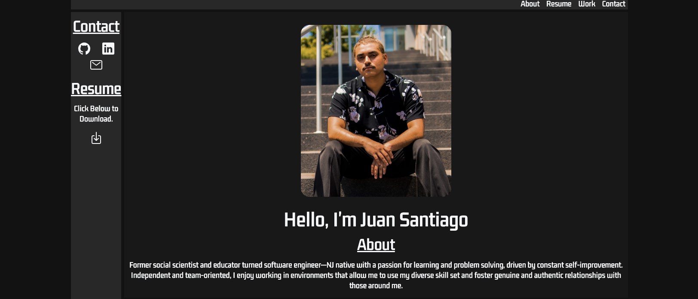

# Juan Santiago Portfolio
The following app is my portfolio! In it you will find a section about me, my resume that you can view/download, some of my projects, and links to my Github, Linkedin, and Email.

## Getting Started:
The following is the link to the [portfolio](https://juan-santiago-portfolio-99.netlify.app/) and the link to the [Trello](https://trello.com/b/ETNSKCuh/juan-santiago-portfolio).

## Screenshot:

## Technologies Used:
- CSS
- Javascript
- HTML
- Git
- Bootstrap 5.2
- Ionicons 5.5.2
- Google Fonts

## Next Steps: 

- AAU, I should be able to collapse and expand my resume.
- AAU, I should be able to horizontally scroll through my works.
- AAU, I should be able to have a mobile friendly way to view a pdf.
